### Hi, I'm Sasha 👋

Particle physics researcher at FJFI CTU Prague for STAR
experiment (Brookhaven National Laboratory). I work on jet physics
and interested in making software comfortable for everyone.

🛠 **Stack:** C++ · ROOT · Python · LangChain · Docker · HPC (Condor/slurm)

🌐 [aprozo.com](https://aprozo.com) · 📧 [me@aprozo.com](mailto:aprozo@me.com) · [ORCID](0000-0001-8368-8290) 

  
  

